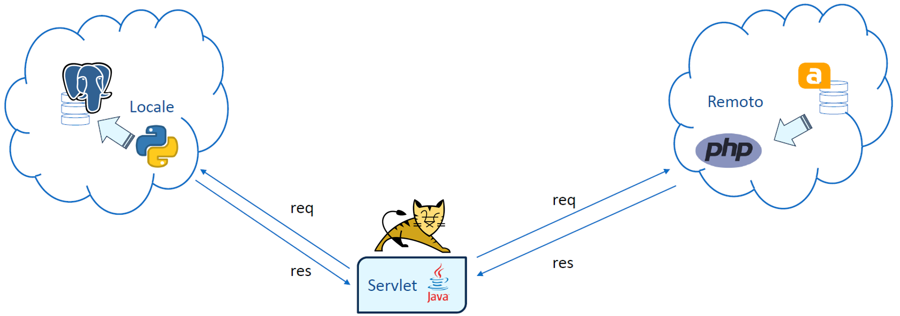

<h1>WebService </h1>
<h3>Progetto per il corso di programmazione web (università degli studi di Bergamo)</h3>
<h5><b>Gruppo GossipWeb</b></h5>
<h6>Longhi Lara (1079261) 
Carrara Federico (1080669) 
Lazzari Alessia (1078863)</h6>

       <h3>Fasi per l’installazione e l’avviamento</h3>
        <ol>
            <li>
                Scaricare il repository da GitHub: 
                <a href="https://github.com/LLonghi02/PW24_WebService" target="_blank">
                    https://github.com/LLonghi02/PW24_WebService
                </a>
                <ul>
                    <li>In questa repository, premere il pulsante code → download ZIP</li>
                    <li>Estrarre il file ZIP</li>
                </ul>
            </li>
            <li>
                Avviare Apache Tomcat
                <ul>
                    <li>Comando windows+R → Aprire: services.msc</li>
                    <li>Click col tasto destro su “Apache Tomcat 10.1 Tomcat10” (o simile in base alla versione presente sul sistema) → avvia</li>
                    <li>
                        Copiare la cartella “AppWeb” presente al percorso <code>"C:\Program Files\Apache Software Foundation\Tomcat 10.1\webapps"</code> nella cartella <code>"C:\...\Tomcat 10.1\webapps"</code> presente nel tuo sistema
                    </li>
                </ul>
            </li>
            <li>
                Creare un Database PostgreSQL
                <ul>
                    <li>Aprire “pgAdmin4”</li>
                    <li>Aprire il tuo Server</li>
                    <li>Fare clic con il tasto destro su Databases → Create → Database…</li>
                    <li>Chiamare il Database “ServSanitario” e salvare</li>
                </ul>
            </li>
            <li>
                Inserire i tuoi dati di accesso PostgreSQL in settings.py
                <ul>
                    <li>
                        Aprire settings.py, situato al percorso 
                        <code>C:\...\PW24_WebService-main\PW24_SSanitario\PW24_SSanitario</code>
                            , in un editor di testo
                    </li>
                    <li>Modificare DATABASES alla riga 80 con il tuo USER e la tua PASSWORD</li>
                </ul>
            </li>
            <li>
                Aprire il terminale
                <ul>
                    <li>Aprire il prompt dei comandi (attenzione NON deve essere Windows PowerShell)</li>
                </ul>
            </li>
            <li>
                Installare le dipendenze e configurare l’ambiente
                <ul>
                    <li>Copiare i codici presenti nel file step_SSanitario.ipynb nella console del terminale e seguire le indicazioni</li>
                </ul>
            </li>
            <li>
                Entrare in Apache Tomcat
                <ul>
                    <li>Aprire il browser</li>
                    <li>Inserire nella barra di ricerca <code>http://localhost:8080/AppWeb/servletSanitario</code></li>
                </ul>
            </li>
            <li>
                Visualizzare le tabelle migrate in PostgreSQL
                <ul>
                    <li>Aprire “pgAdmin4” o effettuare un refresh Databases se ancora aperto dal punto 3</li>
                    <li>Aprire il Database “ServSanitario”, creato in precedenza, estendere Schemas → public → Tables</li>
                </ul>
            </li>
        </ol>
